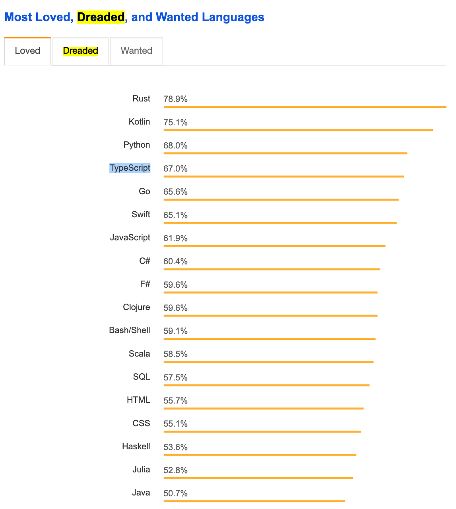
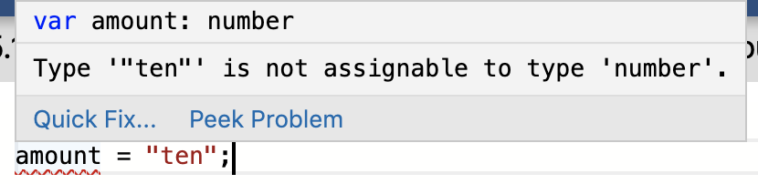
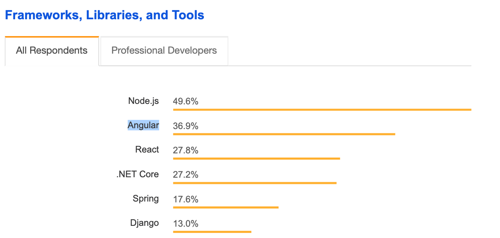
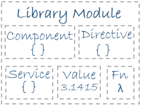
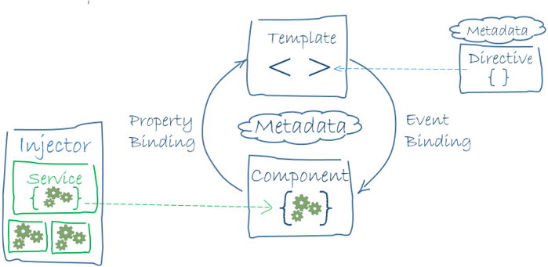

# Lesson Plan: TypeScript Intro + Angular CLI and Architecture

**Prep:**


 Send the students the Install TypeScript and Angular CLI guide before class, and ensure they come to class with NodeJS, TypeScript, and Angular installed. [See the installation guide for details](02-unit/03-module/01-lesson/how_to_install_node_ts_angular.md).


Open the [slidedeck](https://docs.google.com/presentation/d/1cHS7xvVlZ98i0a_25V-_RSuFMTJrabWwU4UPM8njquU/edit?usp=sharing) for this lesson.

Check out the Angular Glossary [here!](https://angular.io/guide/glossary);
 
---

## Stand Up (15 min) 

---


## TypeScript Intro (45 minutes)

### Ensure NodeJS, NPM, TypeScript, and Angular are installed ( 5 min )
* Take a brief moment in class for the TAs to go around and ensure that NodeJS, NPM, TypeScript, and Angular are installed on the students' machines.
* These can quickly be verifieds with:
  * `node -v`
  * `npm -v`
  * `tsc -v`
  * `ng -v`
  * If the installations are successful, a version number and/or info will appear instead of a `command not found` error.

### Instructor Lecture: The Why ( 10 min )

* What is TypeScript? TypeScript (TS) is a **superset** of JavaScript

> Superset: A programming language that contains all the features of a given language and has been expanded or enhanced to include other features as well.

* Did you know? In StackOverflow's 2018 survey, TypeScript came in at #4 for "Most Loved Languages". For reference, JavaScript came in at #7 and Java at #18 - and TypeScript was only very recently created in 2012.
* *Arguably, TypeScript is one of the biggest advances to happen to web development in its history since 1995.* Web development has often been cluttered, buggy, difficult to organize, and difficult to scale.




* Put simply, TypeScript is an advanced form of JavaScript, denoted with the `.ts` file extension.
* TypeScript compiles down to plain JavaScript.
* Any `.js` code is 100% valid as `.ts`.
* VSCode is built in TypeScript.
* Why learn TypeScript?
    * TypeScript is platform-agnostic and can be used to write JS code for any app with JavaScript, such as a basic web app, a React app, a Vue.JS app, a NodeJS server-side app, and of course, an Angular app, and more.
    * You may have already experienced the pains of dynamic-typing in JavaScript.
    > Dynamically-typed languages are those (like JavaScript) where the interpreter assigns variables a type at runtime based on the variable's value at the time.
    * For example, you may create a `var amount = 10`, only for it later to be changed to a string with a line like `amount = "ten"`. This is valid JavaScript and can lead to numerous errors if the coder is not careful.
    * You're already used to **strong typing** in Java, such as `int amount = 10`, so it makes sense to stick with a strongly-typed language to simplify development and reduce bugs.

### Instructor Do: Demonstrate TypeScript in a TS Playground ( 10 min )

#### Primitive Types

In the TS playground, demonstrate the difference between a Java variable, a TypeScript variable, and a JavaScrript variable:
```java
int amount = 10
``` 
```javascript 
var amount = 10
```
```typescript 
var amount: number = 10
```

In TS, we can specify a variable's *type*, hence the name *TypeScript*. This will still compile down to the same vanilla JavaScript, since JavaScript is not strongly typed.

Mention that this TS Playground identically reflects the Intellisense features of VS Code (it's the same editor code running, actually, just in the browser). 

Hover over the `amount` variable to show how TypeScript knows its type.

Delete the `: number` portion so your TS code just shows `var amount = 10`. Hover over the variable name again to show how TypeScript still infers the type, even though the type is not explicitly declared.

Show how TS enforces the type by adding the below invalid TS code:

```typescript 
var amount: number = 10;
amount = "ten";
```


TypeScript will show a red underline; when hovered on, the error message `Type '"ten"' is not assignable to type 'number'.` will show. 

*Note:* TS/JS number types do not distinguish between ints, floats, or doubles. All numbers are simply numbers, although both `parseInt()` and `parseFloat()` exist for converting strings to numbers.

Create variables of different types:

```typescript
var name: string = "TypeScript";

//booleans denote true/false
var isTrue: boolean = true;

// "any" type is quite close to JS, because no type is specified.
// You should rarely, if ever, use any for a type
var anyType1: any = "";
var anyType2: any = 23;
var anyType3: any = {};
```

Point out to students that `String !== string`. These keywords are case sensitive.

```typescript 
// `String` (first letter capitalized) is the built-in JavaScript prototype, while `string` (lowercase) is the TypeScript type.
// Lowercase `string` is used in TypeScript; capitalize S `String` should never be used.
/// !!!AntiPattern - Do Not Do
var tvShow: String = "The Office";

```

Point out that the above will result in an error and that the below code is correct.

```typescript 
// the correct type assignment is with a lowercase `string`
var tvShow: string = "The Office";
```

#### `const` and `let`

Explain that in addition to the `var` keyword, we can also define variables with a `const` or `let`. 

Remind students that `var` is a bit of an *outdated* keyword that is primarily used in vanilla JS. **For the sake of this Angular unit, always default to using `const` or `let` instead of `var`, as the remaining use cases for `var` are slim-to-none.**

```typescript
const MY_TOKEN: string = "xyz123456";
MY_TOKEN = "654321xyz"; // Error: Cannot assign to 'MY_TOKEN' because it is a constant.

const YEAR_FOUNDED = 1776;
YEAR_FOUNDED = 1778; // Error: Cannot assign to 'YEAR_FOUNDED' because it is a constant.

// let is just like var, but is block-scoped instead of function-scoped.
// You don't need to worry about what this means too much, as you'll use `let` almost exclusively
let dayOfYear = 124;
dayOfYear = 139; // valid; let can be reassigned

```

#### Objects

In JavaScript, objects are dynamic. Properties can be added anytime. For example:
```javascript
// JavaScript
var dog = {
  name: "Devo",
  color: "brown"
};
dog.name = "Ted";

// In JS, you can add a new property anytime, such as `.additionalProperty`:
dog.additionalProperty = "A new property added to the dog object"
```

However, in TypeScript, when an object is assigned to a variable, it is inferred *that this variable only has the properties initially assigned to it*. Classes and interfaces will be used for more dynamic variables.
```typescript
// TypeScript
var dog = {
  name: "Devo",
  color: "brown"
};
dog.name = "Ted";

// Error: Property 'additionalProperty' does not exist on type '{ name: string; color: string; }'
dog.additionalProperty = "A new property added to the dog object" 
// Classes and interfaces will be used for more dynamic variables.
```

### Students Do: Experiment with TS Strongly-Typed Variables ( 10 min )

**Instructions**

You are writing code to manage a zoo. 

In the [TypeScript Playground](https://www.typescriptlang.org/play/):

1. Create a few strongly-typed variables that you would need to store general data about the zoo, such as number of animals, number of employees, name of the zoo, city, and state. For each number and string variable, create explicitly-typed and implicity-typed versions.
2. In your code, try assigning a number value to a string variable. Note that TS catches this error with a red underline.
3. In your code, try assigning a string value to a number variable. Note that TS catches this error with a red underline.
4. Change a few variables to `const` and `let` instead of `var`. Try reassigning a `const` to a different primitive property (to a `string` or `number`) and note the error TypeScript gives you.
5. Create an object of an animal of your choosing with the `let` keyword, and assign to it a few properties, such as `numberOfLegs`, `heightFeet`, `heightInches`, `weight`, and `name`.
6. On a separate line, try to add a new property to the animal object you created. Note that TS marks this as an error. Hover over the variable with your cursor to see what type TS infers the variable to be.
7. If time permits, skim over TypeScript's documentation on [classes](https://www.typescriptlang.org/docs/handbook/classes.html) and [interfaces](https://www.typescriptlang.org/docs/handbook/interfaces.html).

### Instructor Do: TS Classes and Interfaces ( 10 min )

* Explain that much like in Java, TypeScript has classes and interfaces, allowing for true object-oriented development. Classes in plain JavaScript are tricky and/or non-existent (depending on which version of JavaScript you're using, which also depends on what browser you're running JavaScript in).
* A TypeScript class can simply be created with the `class` keyword:

```typescript
class Animal {
  name: string;
  numLegs: number;
}
console.log('Animal class', Animal);
```

* Once again, as opposed to Java, a property is denoted with a colon `:` *after* the property name, not before.
* To *instantiate* a class, we use the `new` keyword:

```typescript
class Animal {
  name: string; // create a property named "name"
  numLegs: number = 4; // create a property named "numLegs" and assign a value of 4 to it
}

const dog = new Animal();
// After the the class is instantiated, we can assign values to the class's properties.
dog.name = "Devo";
console.log('the dog', dog);
// However, creating the class and then initializing its properties immediately after isn't best practice. We should use a constructor() or set the value on the property itself, such as in the `numLegs` property
// Of course, class properties can be modified later, but at creation, the class should be ready to use immediately after being instantiated.
```

* Explain and demonstrate that a `constructor()` method is called everytime a class is instantiated:

```typescript
class Animal {

  constructor() {
    this.name = "Devo";
  }

  name: string;
  numLegs: number = 4;
}

const dog = new Animal();
```

* However, the above code just hardcodes a string value onto the `name` property and probably isn't that helpful.
* Let's update the constructor to take in an argument:

```typescript
class Animal {

  constructor(name: string) {
    this.name = name;
  }

  name: string;
  numLegs: number = 4;
}

const dog = new Animal("Devo");
```

* Now we have a successful constructor. Note how in the class, the class property is referenced through the `this` keyword.

* Let's now create a subclass:

```typescript
class Animal {

  constructor(name: string) {
    this.name = name;
  }

  name: string;
  numLegs: number = 4;
}

class Dog extends Animal {

  constructor(name: string, breed: string) {
      super(name);
      this.breed = breed;
  }
  breed: string;
}

const dog = new Dog("Devo", "Lab");
```
* In TypeScript, we use the `extends` keyword to denote a subclass that extends a class.
* Important: When extending a class, the `super()` method must be called in the subclass's constructor to run the parent class's `constructor(name: string)` method. In this case, we pass `name` in `super(name)` to run the parent class's `constructor(name: string)`.
* Lastly, we then assign the `breed` argument to the `Dog` class's `breed` property.


* Classes can also have optional properties, denoted with a `?` mark:

```typescript
class Animal {

  constructor(name: string) {
    this.name = name;
  }

  name: string;
  numLegs: number = 4;
}

class Dog extends Animal {

  constructor(name: string, breed: string) {
      super(name);
      this.breed = breed;
  }
  breed: string;
  isChipped?: boolean;
}

const dog = new Dog("Devo", "Lab");
dog.isChipped = true; // an optional property is an appropriate time to not assign it in the constructor function, since it is, of course, *optional*
```

* However, in TypeScript, we can also use **optional parameters in functions**. Consider:
```typescript
class Animal {

  constructor(name: string) {
    this.name = name;
  }

  name: string;
  numLegs: number = 4;
}

class Dog extends Animal {

  constructor(name: string, breed: string, isChipped?: boolean) {
      super(name);
      this.breed = breed;
      
      if (isChipped !== undefined) {
        this.isChipped = isChipped;
      }
        // If you wish, you can eliminate the if statement and just have `this.isChipped = isChipped;`
        // Why? Because this.isChipped (the class property) is already undefined at the beginning because it's optional and hasn't been defined.
        // If isChipped (the argument) is undefined, then technically you're just assigning this.isChipped to be undefined, and it's already undefined.
  }
  breed: string;
  isChipped?: boolean;
}

const dog1 = new Dog("Devo", "Lab", true);
const dog2 = new Dog("Spot", "Husky"); // due to the optional 3rd argument, we have the option of including it or not

console.log(`dog1 - isChipped is true`, dog1)
console.log(`dog2 - isChipped is not defined`, dog2)
```

---

## BREAK ( 5 min)

---

### Partners Do: TypeScript Classes ( 10 min )

**Instructions**

You are now writing code to manage a small office. In the [TypeScript Playground](https://www.typescriptlang.org/play/):

1. Create a `Person` class with a few properties, such as `age`, `eyeColor`, `hairColor`, and also an optional property, such as `isEmployed`. Include a constructor function and have it assign all of the class's properties from the constructor's arguments.
2. Create two different instances of the `Person` class.
3. Update the optional property of one of the `Person`s using dot notation.
4. Create a subclass of the `Person`, such as `Doctor`. Ensure the `super()` method is correctly called.
5. Instantiate the subclass of the `Doctor` and log it to the console.

---

## Angular Intro (45 minutes)

### Instructor Lecture: Angular: The Why ( 10 min )

* Did you know? In StackOverflow's 2018 survey, Angular is the most-used front-end framework (and the #2 most-used framework overall).
* Angular streamlines web development beautifully and has gained a strong following, especially amongst back-end developers used to a language like Java, since Angular + TypeScript's syntax and practices closely reflect OOP back-end languages much moreso than JavaScript.
* *Arguably, Angular is one of the greatest web front-end technologies since jQuery in 2006*, along with its competing frameworks like React.
* However, due to its modular nature and encapsulation, Angular is exceptionally suited for large-scale, enterprise application development over React.
* Fun fact: Angular is an open-source result of a partnership between two behemoths: Google and Microsoft. Google sponsors and maintains Angular, while Microsoft sponsors and maintains TypeScript, which Angular is built upon. (Facebook sponsors and maintains React).



* So why learn Angular? 
  * To build immensely powerful, scalable, and bug-free web applications with ease.
  * Building a large web app in Angular will be __far less__ frustrating than working with jQuery or vanilla JS.
* As you build an Angular app, **you will begin to feel and understand its structure for how things are done**. Angular is **opininated**, meaning there is a correct and better way to do things than develop free-form, and for good reason.
* By learning Angular and TypeScript, you truly can become a full-stack, multi-platform developer with the ability to deploy to **any device**: Browsers, servers (NodeTS/NodeJS), iOS/Android (NativeScript, Ionic), and desktop (Electron).
* Angular does have a steeper initial learning curve than React, but the time spent is well worth it.


#### Architecture
* Much like a back-end application, [Angular has a strict paradigm for architecture](https://angular.io/guide/architecture).



###### Modules
* At the top level, an Angular application is organized into **modules**.
* Modules contain and encapsulate components, directives, services, values, functions, and more.
* **Components** and **services** will be your most-oft-used pieces of Angular. Every **component** and **service** *must* be part of a module.
* There will always be 1 root module, often called the **AppModule**.
* In building an app, we logically separate out modules by its ["application domain, workflow, or closely related set of capabilities"](https://angular.io/guide/architecture-modules).
* So if we're building an enterprise application with 5 main areas of functionality, we may group those into 5 different **feature** modules.

##### Components
* Components are the bread and butter of an Angular application. A single component usually contains 3-4 main files. For example, with the main AppComponent, there will be:
1. `app.component.ts` - Our component's logic
2. `app.component.scss/css` - Our component's styling
3. `app.component.html` - Our component's view and layout
4. (Optional) `app.component.spec.ts` - Our component's unit testing spec file

Naming conventions: [https://angular.io/guide/styleguide#naming](https://angular.io/guide/styleguide#naming)



##### Services
* Put simply, **services are where the brunt of your app's logic occurs.**
* According to the official docs: ["A service is a broad category encompassing any value, function, or feature that an app needs. A service is typically a class with a narrow, well-defined purpose. It should do something specific and do it well... Angular distinguishes components from services to increase modularity and reusability. By separating a component's view-related functionality from other kinds of processing, you can make your component classes lean and efficient."](https://angular.io/guide/architecture-services).
* ["Ideally, a component's job is to enable the user experience and nothing more. A component should present properties and methods for data binding, in order to mediate between the view (rendered by the template) and the application logic (which often includes some notion of a model)."](https://angular.io/guide/architecture-services)

* Discuss the Single Responsbility Principle (SRP) with components being responsible for 1 thing
  * This is an art, not just a science, and it requires judgment calls. Students will become better at this as they practice
Link to Style Guide SRP: [https://angular.io/guide/styleguide#single-responsibility](https://angular.io/guide/styleguide#single-responsibility)

### We Do: Create an Angular App - Walkthrough ( min )
* `ng new (appname)` - use scss
* `ng serve`
* Clear AppComponent boilerplate in `app.component.html`
* Walk through key parts of component (decorators, selectors, file references (css/scss, html), class, ngOnInit, constructor), html, scss
* Demonstrate string {{interpolation}} in the AppComponent

```ts
{{ 1 + 1 }}
```

### Instructor Do: App Scaffolding ( min )

File(s): `02-activities/05-inst_todo_start`

* After walking through the app, discuss how the architecture concepts play into the boilerplate app setup (AppModule, 1 component so far).
* Walk through the key JSON properties of the @NgModule decorator in AppModule, namely `imports`, `providers`, `declarations`, and the 1 unique AppModule one, `bootstrap`.
* Main `module.ts` takeaways: `imports` imports modules and `declarations` declares components. `providers` will be used occasionally for pipes and other injectables. Services are injectables, but they are provided at the root level via the `providedIn: 'root'` property on the `@Injectable` decorator.

* Get started on the To-Do list: Create 2 new components, a NavbarComponent and a ListComponent
* Use `ng generate component <path/name>`

```
ng generate component navbar
ng generate component list
```

Then, install bootstrap:

```
npm install bootstrap
```

Head into `src/index.html` and add a link to the Bootstrap CDN:

```html
  <link rel="stylesheet" href="https://stackpath.bootstrapcdn.com/bootstrap/4.3.1/css/bootstrap.min.css"
    integrity="sha384-ggOyR0iXCbMQv3Xipma34MD+dH/1fQ784/j6cY/iJTQUOhcWr7x9JvoRxT2MZw1T" crossorigin="anonymous">
```

* Navbar: [Grab boilerplate bootstrap for a navbar](https://getbootstrap.com/docs/4.0/components/navbar/) and paste it into the Navbar component. The ListComponent is for your list of tasks

Note: Depending on the Navbar boilerplate code, you may need to import `popper.js` for functionality!

### Partners Do: App Scaffolding

File(s): `02-activities/06-stu_todo_start`

* Create the same above components to scaffold the To-Do list component. 

* Add a dynamic title to your Navbar title and use string interpolation to have the title come from the component's property (instead of hard coding the title).

### Instructor Do: *ngFor ( min )

File(s): `02-activites/07-inst_*ngFor/src`

---

**NOTE:** From here on, we'll be supplying solved code via the `src` folder! Please copy and paste the solved `src` folder into an existing angular project to see the results!

---

* Grab boilerplate bootstrap list group code and paste it into the ListComponent
* Add a `tasks: string[] = []` property to `list.component.ts` and prepopulate with a few strings, such as "Walk the Dog" and "Feed the Dog"

```ts
tasks: string[] = ["Walk the Dog", "Cook Breakfast", "Get Dressed"];
```

* Show how the array itself can be displayed directly still with {{string interpolation}}

```html
{{ tasks }}
```

* Show, as a dilemma, how we want to repeat a list of HTML elements and not just show the tasks as a string

* Introduce `*ngFor="let task of tasks"` and have it repeat the list tasks

```html
<ul class="list-group">
    <li *ngFor="let task of tasks" class="list-group-item">{{ task }}</li>
</ul>
```

### Partner Do: Add *ngFor to app ( min )
1. Start by installing Bootstrap
1. Add a `tasks: string[] = []` property to the ListComponent and pre populate with a few strings. 
1. Use *ngFor="let task of tasks" and have it repeat the list tasks.


### Instructor Do: Review ( 5 min )
---

## *ngIf + S/CSS in Angular( min )

### Instructor Do: *ngIf ( min )
* Explain that we may want to add a button to show/display the list
* Add `displayList = true` property to list.component.ts
* Add a button with an `*ngIf="displayList"`

```html
<button *ngIf="displayList" type="button" class="btn btn-primary">Primary</button>
```

* Discuss `(click)` events
* Add `(click)="displayList = !displayList"`

```html
<button *ngIf="displayList" (click)="displayList = !displayList" type="button" class="btn btn-primary">Primary</button>
```

* Use the click event to briefly touch on Angular expressions in a template and what can/cannot be done there.

* Create a new method called `onToggleDisplay()`. Discuss that `on` is standard syntax for responding to events.


* Add code in method to toggle `this.displayList`.

* Replace `(click)` event code with the `onToggleDisplay()` method and show how it runs

```html
<button *ngIf="displayList" (click)="onToggleDisplay()" type="button" class="btn btn-primary">Primary</button>
```

### Students Do: *ngIf

File(s): `02-activites/10-stu_*ngIf`

* Implement the above Toggle Display button on the ListComponent

### Instructor Do: Review ( 5 min )

### Instructor Do: SCSS/SASS vs. CSS ( 10 min )

File(s): `02-activites/11-inst_SCSS_SASS`

* Send out link to SCSS/SASS docs. Discuss differences (also a superset like TS). The additional features are optional, but are actually *easier* to use than plain CSS.

[SASS Documentation](https://sass-lang.com/documentation)

* Demonstrate CSS encapsulation, how changing CSS in one component's file doesn't affect other components

Inside of list.component.scss, write the following code:

```scss
* {
    background: Blue;
}
```

Then inside of nav.component.scss, write the following code:

```scss
* {
    background: Red;
}
```

### Students Do: Styling the Components ( 10 min )

Now it's your turn! Using SCSS/SASSS, add styling to ListComponent and NavbarComponent.

### Instructor Do: Build the App ( min )
* `ng build`, `ng build --aot`, `ng build --prod`. Show in dist folder and serve it. Discuss how it can easily be deployed as a static site.
* Discuss Ahead-of-Time compilation and why it's useful (especially in that it checks your HTML templates for any undefined references, such as a `title` if there is no `title` in the component)

### Students Do: Build the App ( 5 min )
* `ng build`, `ng build --aot`, `ng build --prod`

### Instructor Do: Review ( min )

* If time permits, `ng generate service` and discuss how we would use it to manage tasks rather than just the component. Also inject it into the component's constructor with `constructor(private tasksService: TasksService)`.
---

© 2019 Trilogy Education Services

[i_do]: https://github.com/coding-boot-camp/Java-6-module/blob/master/id_resources/icons/i_do/res/mipmap-hdpi/i_do.png "Instructor do"


[we_do]: https://github.com/coding-boot-camp/Java-6-module/blob/master/id_resources/icons/we_do/res/mipmap-hdpi/we_do.png "We Do"


[you_do]: https://github.com/coding-boot-camp/Java-6-module/blob/master/id_resources/icons/you_do/res/mipmap-hdpi/you_do.png "Student Do"


[assess]: https://github.com/coding-boot-camp/Java-6-module/blob/master/id_resources/icons/assess/res/mipmap-hdpi/assess.png "Assessment"


[break]: https://github.com/coding-boot-camp/Java-6-module/blob/master/id_resources/icons/break/res/mipmap-hdpi/break.png "Break"


[warn]: https://github.com/coding-boot-camp/Java-6-module/blob/master/id_resources/icons/warn/res/mipmap-hdpi/warn.png "Warning"