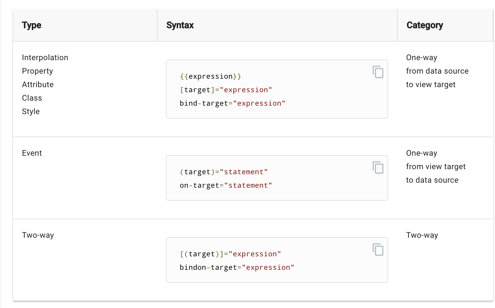

Lesson Plan: 9.2

File(s): `02-activities/`

Open the [slidedeck](https://docs.google.com/presentation/d/1w8FFA3-IRx0W7MxKMNazN6pNhwBWlN88vAxwwYuoEyA/edit?usp=sharing) for this lesson.

## Data Binding with Angular (45 minutes)

### We Do/Warmup: Angular Architecture Review ( 15 min )

Discuss a basic CRUD app and walk through what the best way to separate out modules/components/services would be. 

Make sure that this becomes more of an interactive discussion!

Then, have students hand (or computer) draw diagram for how they would structure the to-do application.

Have a few show to the class & field questions/discussion.

### Instructor Do: In-Depth Angular Components ( 15 min )

For each topic below, spend a few seconds explaining each bullet point to students:

* HTML
    * Selectors for components
    * Almost all HTML is valid; `<script>` is forbidden
    * Expressions
    * {{string interpolation}}
    * Star * decorators (they manipulate the DOM) - can only have one per HTML tag
    * [] = property binding - THIS IS NOT ATTRIBUTE BINDING
        * Example: Bind ``

* See: https://angular.io/guide/template-syntax

* Discuss the below bindings (you can pass on attribute and class, since attributes are rarely used and instead of direct class binding, `ngClass` is used).

* Discuss one-way bindings vs two-way

One-way and two-way binding can get a bit in-depth conceptually, but the important thing to understand is that two-way binding is only done through [(ngModel)] and otherwise, one-way binding is used. For example to bind a class/component property to its view/template/html.

Thus, unidirectional data flow between the component’s logic and the view (data is actually flowing both ways, but the accessors and methods only operate in a one-way direction, with the exception of ngModel)

It will become quite intuitive as you work with Angular (since Angular manages it behind the scenes and you don’t have to worry about it much), but it’s something to know the name for it to research it more in-depth (if desired down the road) and to be able to touch on in an interview.

Review this for additional lecture content: https://angular.io/guide/template-syntax#two-way-binding-





### Partners Do: Binding with Angular ( min )

File(s): `02-activities/01-stu_binding/README.md`

For this activity, start by using the to-do list application code that you have from the previous class.

Test out property binding and event binding by doing the following:

* Change the Toggle Display button to be a mouseover event instead of click
* Create an image with a dynamic `src` tag through property binding

### Instructor Review: Binding with Angular ( 5 min )

File(s): `02-activities/01-stu_binding/src`

---

## break ( 5 mins )
![break][break]

---

## Properties and Expressions (45 minutes)

### Instructor Lecture: Angular Properties and Expressions ( min )

* Discuss property binding more in-depth: https://angular.io/guide/template-syntax#property-binding-property

* The students don't need to understand this in-detail, but the main takeaways is that in Angular, HTML has *properties*. 
Attributes are rarely used. However, in practice, these will feel like you're working with HTML attributes, but with a bit more functionality.

* Discuss Template Expressions in-detail: https://angular.io/guide/template-syntax#template-expressions

* These are much more important to know/understand than property binding

* Be sure to mention how Angular offers many ways to add logic to the template/HTML, but complex logic should *always* be in a TS file, not HTML.

### Instructor Lecture: Angular LifeCycle Hooks ( 5 min )

* First discuss interfaces: There is already one in each component by default with `NgOnInit` in the `x.component.ts` file.

* Interfaces are a sort of *contract*.

* NgOnInit, AfterViewInit, OnDestroy are the important ones. Important that these won't function if the component class doesn't implement the respective interface.

```ts
// x.component.ts
import { Component, OnInit, AfterViewInit, OnDestroy } from '@angular/core';

export class ListComponent implements OnInit, AfterViewInit, OnDestroy {

  ngOnInit() {
    console.log("on init");
  }
  ngAfterViewInit() {
    console.log("after view init");
  }
  ngOnDestroy() {
    console.log("on destroy")
  }
}
```

Then send out the following resource out to students: https://angular.io/guide/lifecycle-hooks

### Students Do: Lifecycle ( 10 min )

File(s): `02-activities/02-stu_lifecycle/README.md`

* Implement the `ngOnInit`, `ngAfterViewInit`, and `ngOnDestroy` lifecycle hooks and console.log() for each of them to get a feel for what happens, when.

Feel free to use the following documentation if you get stuck: https://angular.io/guide/lifecycle-hooks

### Instructor Do: Review ( 5 min )

File(s): `02-activities/02-stu_lifecycle/solved`


---

## lunch (60 min) 
![break][break]

---

## User Input and Delete (45 minutes)

### Instructor Do: Components: Delete Task from Tasks ( min )

File(s): `02-activities/03-inst_delete`

* Next to each list item, add an X or Delete button. Add click event to trigger `onDeleteTask(i)`.

```ts
<ul class="list-group">
    <li *ngFor="let task of tasks" class="list-group-item">
        <p>{{ task }}</p>
        <button (click)="onDeleteTask(i)" class="btn btn-danger">X</button>
    </li>
</ul>
```

In order to access our iterator, i, we need to alter our *ngFor property:

```ts
<ul class="list-group">
    <li *ngFor="let task of tasks; let i = index" class="list-group-item">
        <p>{{ task }}</p>
        <button (click)="onDeleteTask(i)" class="btn btn-danger">X</button>
    </li>
</ul>
```

* In `onDeleteTask(i)`, splice the `tasks` array to remove the item at index. UI will automatically update.

```ts
  onDeleteTask(i: number) {
    this.tasks.splice(i,1);
  }
```

### Students Do: Components: Delete Task from Tasks ( min )

File(s): `02-activities/04-stu_delete`

Using the code that you have so far for your To-D list application, complete the following tasks:

1. Create a new button that displays an "X" or "Delete" and add a click event to trigger a method called `onDeleteTask(i)`. Be sure to refactor your code such that each list item will have a delete button.

1. Then, create an `onDeleteTask(i)` method that splices the `tasks` array to remove the item at a given index.


### Instructor Lecture/Do: User Input with [(ngModel)] ( min )

File(s): `02-activities/`

* Briefly mention two-way binding and how there are 2 different main form modules in Angular: 

    - Template-Driven Forms
    - Reactive Forms

* Reactive forms will primarily be used for user input, but there is a super-useful feature of Template-Driven Forms: ngModel, which allows for two-way binding.

Fun-Fact: Two-way binding is one of the major factors that helped AngularJS 1.x originally soar in popularity

* Back to the To-Do list: We would want to add a new task, of course. Import the `FormsModule` into the `AppModule`.

```ts
//app.module.ts
import { FormsModule } from '@angular/forms';

imports: [
    BrowserModule,
    FormsModule
]
```

* Add a `newTaskText` property to the ListComponent above the list of items.

```ts
//list.component.ts
newTaskText: string = "";
```

* Add an input above the tasks list with `<input [(ngModel)]="newTaskText"`>

```html
<!--list.component.html-->
<input [(ngModel)]="newTaskText" class="form-control">
```

* Discuss why ngModel has both (event binding) and [property binding] around it.

* Add an "Add Task" button with `(click)="onCreateNewTask(newTaskText)"`, assign click event to a new `onCreateNewTask(name: string)` method, and have it push a new task onto the `tasks` property.

```html
<!--list.component.html-->
<button (click)="onCreateNewTask(newTaskText)" class="btn btn-success">Add Task</button>
```

```ts
//list.component.ts
  onCreateNewTask(name: string) {
    this.tasks.push(name);
    this.newTaskText = "";
  }
```

* Add a `<p>` tag that displays the total number of tasks with `<p>{{tasks.length}}</p>`

```html
<!--list.component.html-->
<p>{{tasks.length}}</p>
```

### Partner Do: User Input ( 25 min )

File(s): `02-activities/06-stu_user_input/README.md`

Instructions:

You'll be continuing to add code to your existing To-Do application.

For this activity, do the following:

1. Import the `FormsModule` into app.module.ts. Be sure to also add the imported FormsModule into the `imports` object.
1. Add a `newTaskText` property to the ListComponent above the list of items.
1. Add an input above the tasks list with `<input [(ngModel)]="newTaskText"`>
1. Add an "Add Task" button with `(click)="onCreateNewTask(newTaskText)"`, assign click event to a new `onCreateNewTask(name: string)` method, and have it push a new task onto the `tasks` property.
1. Add a `<p>` tag that displays the total number of tasks with `<p>{{tasks.length}}</p>`.

### Instructor Do: Review ( 5 min )

File(s): `02-activities/06-stu_user_input/README.md`

### Instructor Do: Edit Tasks [(ngModel)] ( min )

File(s): `02-activities/07-inst_edit`

* The above `[(ngModel)]` use was to add a new task, but what if we want to edit a current task?

* First, we need an edit button
* Add edit button to each list item, to the right of the text
* When clicked, task text should turn into a new input field (with `[(ngModel)]="task"`) and hide the task text. 
* Add a Save button next to the Edit button. When Save is clicked, turn editing off for that list item. Because of two-way binding, the task will be updated in the `tasks` array.

```html
<ul class="list-group">
    <li *ngFor="let task of tasks; let i = index" class="list-group-item">
        <p *ngIf="!taskIdsBeingEdited[i]">{{ task }} </p>
        <input *ngIf="taskIdsBeingEdited[i]" [(ngModel)]="task">
        <button *ngIf="!taskIdsBeingEdited[i]" (click)="onStartEditTask(i)" class="btn btn-warning">Edit</button>
        <button *ngIf="taskIdsBeingEdited[i]" (click)="onSaveEditTask(i)" class="btn btn-success">Save</button>
        <button (click)="onDeleteTask(i)" class="btn btn-danger">X</button>
    </li>
</ul>
```

```ts
  taskIdsBeingEdited = {};

  onStartEditTask(i: number) {
    this.taskIdsBeingEdited[i] = true;
  }

  onSaveEditTask(i: number) {
    this.taskIdsBeingEdited[i] = false;
  }
```

* Mention that because we haven't hooked the app up to an API, that the data changes will *not* persist.

### Partners Do: Edit Tasks [(ngModel)] ( min )

File(s): `02-activities/08-stu_edit/README.md`

Instructions:

1. Add an edit button to each list item, to the right of the text.
1. When clicked, task text should turn into a new input field (with `[(ngModel)]="task"`) and hide the task text. 
1. Add a Save button next to the Edit button. 
1. When Save is clicked, turn editing off for that list item. Because of two-way binding, the task will be updated in the `tasks` array.

HINT: Don't forget about conditional rendering with *ngIf!

---

## break ( 5 mins )
![break][break]

---

## Services (45 minutes)

### Instructor Do: Intro to Services ( min )

File(s): `02-activities/9-inst_services`

* Our app currently doesn't save any data
* To show how a component's data stays within a component, duplicate the `<app-list-component>` in a second column to show how modifiying one doesnt' affect the other.

* *Any* complex logic should almost always be in a Service, not a Component; one example is data CRUD!

*  Why? If we add CRUD logic to just our list component, then we have to repeat and duplicate that same logic for another component, violating the DRY principle.

Remind students of what the DRY principle is!

* What if another component wants to use the same CRUD logic for tasks? What if the lists are on 2 separate screens and we want them to reflect the same data? (Hence why we duplicated the list component above, for example)

* Introduce Services and generate a TasksService using the following command: `ng generate service tasks`. 

Angular automatically adds the `Service` suffix.

* Walk through the 2 generated files (the spec file is the second)

* Discuss Angular's DI - Dependency Injection. See docs: https://angular.io/guide/dependency-injection
    * Like one- and two-way bindings, DI can be in-depth conceptually, but the important practical thing to understand when getting started is that:

        1. You can create services that are provided at the root of the application (or specific to a module) and thus
        1. Inject these services into other Angular components and services to delegate tasks.
        1. The provided services are **singletons**, meaning the instantiated service class is *shared* across the whole application;
        
        
This is helpful because you don't have to `new` the class yourself nor worry about duplicate service classes.
This helps keep your app modular and DRY

* Discuss `providedIn`, which is automatically created in a generated service. It means the service is provided at the application `root`, so can be used anywhere.

* Services can be injected into components and other services (and more, like directives, resolvers, guards, etc., but components and services are the main focus right now)

* Inject into component with:

```ts
import {TasksService} from '../tasks.service';

constructor(private tasksService: TasksService) {this.tasksService = tasksService}
```


### Students Do: Generate Tasks Service and Inject ( min )

File(s): `02-activities/10-stu_services/README.md`

Instructions:

1. Generate a TasksService using the following command: `ng generate service tasks`. 
1. Inject our new service, TasksService, into our list component.

### Instructor Do: Review ( 5 min )

File(s): `02-activities/10-stu_services/solved`

### Instructor Do: Move Tasks Logic to Services ( min )

File(s): `02-activities/11-inst_services_2`

Next, we'll be moving *tasks* CRUD functionality to the service and refactor our list component to use the service's methods.

* Walk students through this process:

Move the logic for adding and deleting a task from list.component.ts to the service (tasks.service.ts).

```ts
// tasks.services.ts
  addTask(task) {
    this.tasks.push(task);
  }

  deleteTask(i: number) {
    console.log(i);
    this.tasks.splice(i, 1);
  }
```

Move the tasks array over to the service as well. 

```ts
// tasks.services.ts
tasks: string[] = ["Walk the Dog", "Cook Breakfast", "Get Dressed"];
```

Create a method that returns the tasks in the tasks array in the service.

```ts
// tasks.services.ts
  getTasks(): string[] {
    return this.tasks;
  }
```

We'll then have to make a few changes to our list component:

```ts
// list.component.ts
  getTasks() {
    setTimeout(()=>{
      this.tasks=this.tasksService.getTasks();
    },0);
  }
```

Point out that we are using a setTimeout() here to force angular to update it's view.

Add `this.getTasks()`  to our ngOnInit:

```ts
// list.component.ts
  ngOnInit() {
    console.log("on init");
    this.getTasks();
  }
```

Finally, we'll just need to change our Create and Delete tasks to use the service:

```ts
// list.component.ts
  onDeleteTask(i: number) {
    this.tasksService.deleteTask(i);
    this.getTasks();
  }

  onCreateNewTask(name: string) {
    this.tasksService.addTask(name);
    this.newTaskText = "";
    this.getTasks();
  }
```

### Students Do: Move Tasks Logic to Services ( min )

File(s): `02-activities/12-stu_services_2/README.md`

Instructions:

Following the steps shown in class, refactor your code such that tasks.service.ts holds all of your CRUD actions and list.component.ts to use the service's CRUD methods.

### Instructor Do: Review ( 5 min )

File(s): `02-activities/12-stu_services_2/solved`

---

## Wrap Up 

Assign homework and begin the assessment. Students may leave once they have successfully completed their assessment. Students who are unable to complete the assessment, must stay until the end of study hall for guided remediation. 
 
 ---

© 2019 Trilogy Education Services

[i_do]: https://github.com/coding-boot-camp/Java-6-module/blob/master/id_resources/icons/i_do/res/mipmap-hdpi/i_do.png "Instructor do"


[we_do]: https://github.com/coding-boot-camp/Java-6-module/blob/master/id_resources/icons/we_do/res/mipmap-hdpi/we_do.png "We Do"


[you_do]: https://github.com/coding-boot-camp/Java-6-module/blob/master/id_resources/icons/you_do/res/mipmap-hdpi/you_do.png "Student Do"


[assess]: https://github.com/coding-boot-camp/Java-6-module/blob/master/id_resources/icons/assess/res/mipmap-hdpi/assess.png "Assessment"


[break]: https://github.com/coding-boot-camp/Java-6-module/blob/master/id_resources/icons/break/res/mipmap-hdpi/break.png "Break"


[warn]: https://github.com/coding-boot-camp/Java-6-module/blob/master/id_resources/icons/warn/res/mipmap-hdpi/warn.png "Warning"