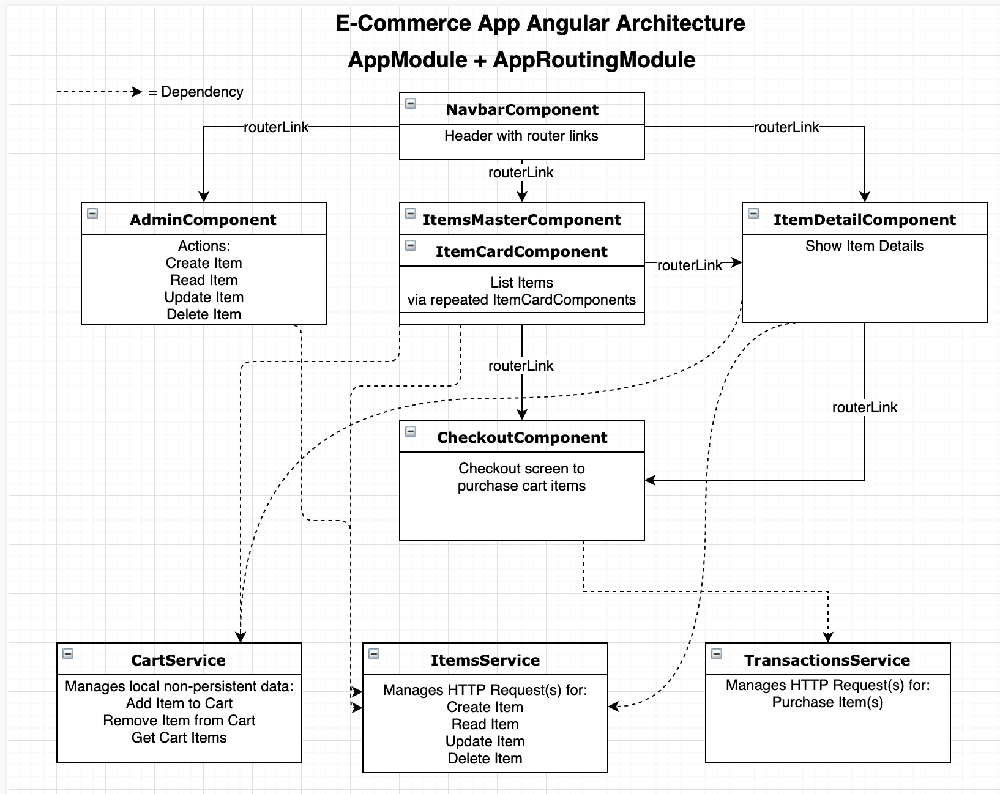

# Lesson Plan: 10.1

Open the [slidedeck](https://docs.google.com/presentation/d/1trLdWGcDCUFCz_L6U_y0-kMGbTa7B8_A-XtXFr7-4pw/edit?usp=sharing) for this lesson.

## Review Creating a CRUD Application with E-Commerce (45 minutes)


### The Why ( 5 min )

Today is a speedy recap of building a CRUD app in Angular; the students have done most everything in this lesson already, so it will serve as a review in a different app context (from a CRUD To-Do app to a CRUD E-Commerce app). 

#### Demo

* Demo the `e-commerce_pre_routing_http` to show what the class will be building today.

* NOTE: Today will essentially be an in-depth review of all of last week's topics, with a few extra added, such as `@Input`.

    * The `AppComponent` template may seem a bit wonky with multiple components all displayed at the same time, but the reason is to ensure all the components themselves are working, which will then be restructured into routes.

**Prep:**

<details style='background: #ddd;'>

  <summary> Video Walkthrough of the E-Commerce Application (Part 1) </summary> 

  Review the live walkthrough as needed: https://youtu.be/HIF6QRdfoW8. Send out to students after class.
  
</details>

### Instructor Do: Discussion: CRUD E-Commerce Pt 1 ( 20 min )

* Immediately after demoing the `e-commerce_pre_routing_http` app, ask the students how this app should be structured and whiteboard with them.

    * The students may feel a bit overwhelmed at first, but as with anything, *break the problem down!!!*

* Start with what screens we will show: Masster Item List, Detail View, Checkout Screen, Admin Screen

    * Quite simply, these are all just their own components that will be routed to.

* Discuss what services would be needed (keep the Single Responsibility Principle in mind; don't just throw all API requests into one service because they're API requests. Rather, have 1 service be responsible for Items, 1 service responsible for checkout, etc.).

* After whiteboarding, then bring up the Angular architecture diagram for this app

* Note that there are multiple ways this could be done; planning an app's architecture can be both an art and a science with numerous judgment calls based on an extremely-numerous number of factors. 

* However, there are principles that will persist across all software development, such as SOLID principles (SRP, Single Responsiblity Principle being one example, which we especially use for components)

* Thus, a different structure could be used (and feel free to), but here's an example and what's in the code:



### Students Do: Generate Architecture Components with CLI ( 15 min )

File(s): `02-activities/01-stu_scaffold_project/README.md`

* Using the above chart, scaffold the application's key pieces: `AdminComponent`, `NavbarComponent`, `ItemsMasterComponent`, `ItemCardComponent`, `ItemDetailComponent`, `CheckoutComponent`, then the `CartService`, `ItemsService`, and `TransactionsService`

* This is only the basic component generation; no need to start working on the HTML/SCSS/TS just yet.

* Ensure **all** is done via the CLI (or a VS Code Extension like [Angular Files](https://marketplace.visualstudio.com/items?itemName=alexiv.vscode-angular2-files)). There's really no reason *not* to use the CLI for how much time it saves and its ease-of-use.

### Instructor Review: Generate Architecture Components with CLI ( 5 min )

File(s): `02-activities/01-stu_scaffold_project/solved`

* Review how the above was done with the CLI. Ensure all students are on the same page, as this is an oft-used task.

---

## App Construction (45 minutes)

### We Do: Add Bootstrap ( 5 min )

File(s): `02-activities/02-we_add_bootstrap`

* Give a quick refresher as to how we can add a 3rd-party module through `npm install`, or with just a css addition, add it to the `index.html`. Add Bootstrap's `<link>` tag onto the app from the [Bootstrap Website](https://getbootstrap.com/)

* Optional, only if time permits (as it's not necessary): Walkthrough adding boilerplate navbar layout by copying the boilerplate from the Bootstrap site, or just paste from here:

```typescript
<nav class="navbar navbar-expand-lg navbar-light bg-light">
  <a class="navbar-brand" href="#">E-Commerce!</a>

</nav>
```

### We Do: Basic AppComponent ( 5 min )

File(s): `02-activities/03-we_basic_appcomponent`

* Set up a basic `AppComponent`. Explain that because we are *planning* to add routing (but not just yet) that we simply want our components to show on the screen so we can get test them visually:

```html
<app-navbar></app-navbar>
<hr>
<app-items-master></app-items-master>
<hr>
<app-admin></app-admin>
```

*  You can verify that these are displaying by seeing the boilerplate `____ (component name) works!` in the HTML.

### Partners Do: Create `Item` class ( 15 min )

File(s): `02-activities/05-stu_item_class/README.md`

* Create an `Item` class that will be similar to your `Task` class from your To-Do app. Feel free to use your To-Do app as a guide at any point in the following activities.
* Create an `Item` class in your `ItemsService` file.
* Include the following properties:
  * name: string 
  * itemId: string
  * description (optional): string
  * imageUrl (optional): string
  * price (optional): number
* Create a constructor that takes in the following parameters:
  * name: string
  * description (optional): string
  * price (optional): number
  * imageUrl (optional): string
* Set all properties in the constructor using the values passed in besides the `itemId` property
  * To get the value for this property we will be using an npm packaged called `uuid`;
    * First install the package using the command `npm install uuid`
    * Use the following import statement to import the package into the item class: 
    ```ts
    import * as uuid from 'uuid';
    ```
    * Use the following `uuid` method to generate `itemId` property values:
    ```ts
    uuid.v4()
    ```

### Instructor Do: Review `Item` Class ( 10 min )

File(s): `02-activities/04-inst_item_class`

* This will be quite similar to creating the `Task` class from the To-Do list component. Create this in the `ItemsService` and walk through, in detail, the following code:

```typescript
// items.service.ts
import * as uuid from 'uuid';

export class Item {

  constructor(name: string, description?: string, price?: number, imageUrl?: string) {
    this.name = name;

    this.description = description;
    this.price = price;
    this.imageUrl = imageUrl;

    this.itemId = uuid.v4();
  }

  name: string;
  itemId: string;

  description?: string;
  imageUrl?: string;
  price?: number;
}
```

* Note that the `itemId`, which is genereated by `uuid.v4()`, would really be generated by a database, but we'll do it for now for getting the basics of this app running. This can be installed via `npm install uuid`. [Link to npm package](https://www.npmjs.com/package/uuid)

* Call on students to discuss what we did above and why

* Quickly review the optional `?` parameters:s
    * If an argument is passed in, then all is normal
    * If no argument is passed in, the the argument is set to `undefined`
    * Helpful: TypeScript/VS Code will let us know if we didn't provide enough arguments; all non-optional arguments are required (and thus will show an error), and if an argument is optional, then no error is shown if it's not included.

### Student Do: Creating an Add Item Method ( 5 min )

Inside the `items.service.ts` file make the following changes to your `ItemsService` class:
* Create a property called `items` that stores an array of `Item` objects.
* Create an `addItem()` method that takes in the following parameters:
  * name: string
  * description(optional): string
  * price(optional): number
  * imageUrl(optional): string
* Add the following functionality to the `addItem()` method:
  * Create a new item using the `Item` class and push it to the `items` array.
  * Console log the new item added.

### Instructor Do: Review Creating an Add Item Method ( 5 min )

File(s): `02-activities/06-we_add_item`

* This will be quite similar to the `addTask` method from the To-Do list app. Briefly walk through the solution code:

```typescript
//items.service.ts

  items: Item[] = [];

  addItem(name: string, description?: string, price?: number, imageUrl?: string) {
    const newItem = new Item(name, description, price, imageUrl);
    this.items.push(newItem);

    console.log('Item added', this.items)
  }
```

* The console log is optional for testing, but because this isn't a production app, it may be good to include it for debugging. 

### Student Do: Reactive Form Implementation ( 20 min )

For this activity, you will be implementing a reactive form. Feel free to use the documentation at this link for help: https://angular.io/guide/reactive-forms.

Inside your `admin.component.ts` file make the following changes:
* Import the following:
  * FormBuilder ('@angular/forms')
  * ItemsService and Item
* Inject `FormBuilder` and `ItemsService` in the constructor
* Add the property `addItemForm` and set it equal to a form builder group that contains the following:
  * name
  * description
  * price
  * imageUrl
* Add the property `items` which stores an array of `Item` objects.
* Create an `onSubmitForm` method which uses the values from the `addItemForm` property to add a new item with the `ItemsService` and then resets the form.

Inside your `app.module.ts` file make the following changes:
* Import `ReactiveFormsModule` from `@angular/forms`.
* Add `ReactiveFormsModule` to the array of imports. 

Inside your `admin.component.html` make the following changes: 
* Create a form and bind the `formGroup` property to `addItemForm`
  * add a submit event listener that calls `onSubmitForm`
* Add labels and inputs for the following information:
  * name
  * description
  * price
  * imageUrl
* Make sure that the `formControlName` attribute on your inputs corresponds to the names in your `FormBuilder` group.
* Add a submit button.

### Instructor Do: Review Reactive Form Implementation ( 10 min )

File(s): `02-activities/07-inst_reactive_form`

Walk the students through the following solution code: 

```typescript
// admin.component.ts

import { FormBuilder } from '@angular/forms';
import { ItemsService, Item } from '../shared/items.service';


export class AdminComponent implements OnInit {

  addItemForm = this.fb.group({
    name: [''],
    description: [''],
    price: [0],
    imageUrl: ['']
  })

  items: Item[] = []

constructor(
  private fb: FormBuilder,
  private itemsService: ItemsService
  ) { }

  onSubmitForm() {
    const name = this.addItemForm.value.name;
    const description = this.addItemForm.value.description;
    const price = this.addItemForm.value.price;
    const imageUrl = this.addItemForm.value.imageUrl;
    this.itemsService.addItem(name, description, price, imageUrl)

    this.addItemForm.reset();
  }
```

```typescript
// app.module.ts

import { ReactiveFormsModule } from '@angular/forms';

  imports: [
    BrowserModule,
    AppRoutingModule,
    ReactiveFormsModule
  ]
```

HTML; add this within your Bootstrap grid on the `AdminComponent`:

```html
      <form [formGroup]="addItemForm" (ngSubmit)="onSubmitForm()">
        <div class="form-group">

          <label for="nameItem">Name of Item</label>
          <input formControlName="name" type="text" class="form-control" id="nameItem" placeholder="Name of Item">

          <label for="descItem">Description</label>
          <input formControlName="description" type="text" class="form-control" id="descItem"
            placeholder="Description of Item">

          <label for="priceItem">Price</label>
          <input formControlName="price" type="number" class="form-control" id="priceItem" placeholder="Price of Item">

          <label for="imageUrl">Image URL</label>
          <input formControlName="imageUrl" type="text" class="form-control" id="imageUrl" placeholder="Image URL">

        </div>

        <button type="submit" class="btn btn-primary">Submit</button>
      </form>
```
---


### Instructor Do: Display the Items in the `ItemsComponent` + `@Input` ( 15 min )

File(s): `02-activities/09-inst_display_items`

* Now that we can add Items to our app, we want to display the items

* To do so, we're utilizing the `ItemsMasterComponent` and the `ItemCardComponent`. For best illustration, create the HTML for the Item Card *in the `ItemsMasterComponent` first, along with its \*ngFor*. 

* Have the repeated card dipslay the `item.name`, `item.description`, and its index, and its `item.imageUrl` (displaying the image with the bound `[src]=` property). Demo how this works.

* Then, refactor this into the `ItemCardComponent`:
    * Copy over the item card's html into the `ItemCardComponent`
    * Refactor the `ItemsMasterComponent`'s HTML to not render the full HTML of a card, but just the `<app-item-card>`.
    * Pass into each two properties: `[item]="item"` and `[i]="i"`
    * Pose the question: How do we get these two properties into the `ItemCardComponent`?
    * **Introduce `@Input`** and slack out a docs link to it: https://angular.io/api/core/Input. Explain how this allows a component to pass data into a child component. **This is a very important concept**. There are multiple ways to pass data between components, and this is one of the most-used (another most-used would be interacting via Services).
    * Explain how the `@Input` decorator is put into the child component
    * Becuase the `item` variable is passed into the child `ItemCardComponent`, it is then bound to that component's class property and its view. Thus, we can access the individual `item`'s data in the view/HTML of the `ItemComponent` through accessors like `{{item.name}}` in the template.

Results:


```html
<!-- `items-master.component.html` -->

<div class="container">
  <div class="row">
    <div class="col-12">

      <h4>Items for Sale</h4>

      <div class="row">
        <div class="col-6 mb-3" *ngFor="let item of items; let i = index;">
          <app-item-card [item]="item" [i]="i"></app-item-card>
        </div>

      </div>
    </div>
  </div>
</div>

```

```ts
// items-master.component.ts

import { ItemsService, Item } from '../shared/items.service';

@Component({
  selector: 'app-items-master',
  templateUrl: './items-master.component.html',
  styleUrls: ['./items-master.component.scss']
})

export class ItemsMasterComponent implements OnInit {

  items: Item[] = []

  constructor(private itemsService: ItemsService) { }

  ngOnInit() {
    this.getItems();
  }

  getItems() {
    this.items = this.itemsService.getItems();
  }
}


```

```html
<!-- `item-card.component.html` -->

<div class="row">
  <div class="col-12">

    <div class="card">
      
      <div class="card-body">
        <h5 class="card-title"> {{i + 1}}: {{item.name}}</h5>
        <p class="card-text">
          {{item.description}}
        </p>
        <a href="#" class="btn btn-primary">Go somewhere</a>
      </div>
    </div>

  </div>
</div>
```


```typescript
// `item-card.component.ts`:

import { Component, OnInit, Input } from '@angular/core';
import { Item } from '../../shared/items.service';

@Component({
  selector: 'app-item-card',
  templateUrl: './item-card.component.html',
  styleUrls: ['./item-card.component.scss']
})
export class ItemCardComponent implements OnInit {

  @Input() item: Item;
  @Input() i: number;

  constructor() { }

  ngOnInit() {
  }

}
```

```ts
//items.service.ts

getItems(): Item[] {
  return this.items;
}
```

### Partners Do: Add Item Card HTML and Repeat Each Item Card on the `ItemsMasterComponent` ( 15 min )

File(s): `02-activities/10-stu_display_items/README.md`

Instructions:

This one is tricky so take your time and refer to your notes and documentation to help you out.

As was shown in class, you are to create the HTML and the logic for both the ItemsMasterComponent and the ItemCardComponent. 


### Instructor Do: Review ( 2 min )

File(s): `02-activities/10-stu_display_items/solved`

* Briefly recap how we did the above
* Demo how we can now add an Item via the form we created, which will then appear on the `ItemsMasterComponent` as a repeated `ItemCardComponent`

### Student Do: Add Item List to AdminComponent + Delete Functionality ( 25 min )

For this activity we are going to render our item list to the AdminComponent and add delete functionality.

In the `admin.component.ts` file do the following:
* Use an `*ngFor` to iterate through the items and create divs that have the number of each item (index+1), the name of the item, and a delete button for each item.
* Add a `click` event listener to the delete button that calls the method `onDeleteItem` and passes in the `item` as a parameter.

In the `admin.component.ts` file do the following:
* create an `onDeleteItem` method that takes in an `Item` object.
* Then use the `ItemsService` to delete the item.
* Call the `getItems` method to refresh the list of items.

In the `items.service.ts` do the following:
* Create a `deleteItem` method that takes in an `Item` object.
* Remove the `Item` passed in from the `items` array using an array filter method.

### Instructor Do: Review Add Item List to AdminComponent + Delete Functionality ( 15 min )

File(s): `02-activities/`

* Walk the students through the following solution code:

```html
<!-- admin.component.html -->

      <div class="row">
        <div class="col-12">

          <div class="row mb-2" *ngFor="let item of items; let i = index">
            <div class="col-6">
              {{i + 1}}: {{item.name}}
            </div>
            <div class="col-6">
              <button class="btn btn-danger float-right" (click)="onDeleteItem(item)">X</button>
            </div>
          </div>

        </div>
      </div>
```


```typescript
// `admin.component.ts`
...
  onDeleteItem(item: Item) {
    this.itemsService.deleteItem(item);

    this.getItems();
  }
...
```

```typescript
// `items.service.ts`

  deleteItem(item: Item) {
    this.items = this.items.filter((itemToFilter: Item) => {
      return item.itemId !== itemToFilter.itemId;
    })
    console.log('deleted item! Remaining items:', this.items)
  }
```

* Demo: When the delete button is clicked, the item will disappear from the Admin list

* Note: This will not remove an item from on the `ItemsMasterComponent` view. Why? The view was never told to update. The item was removed in `ItemsService`, but the `ItemsMasterComponent` doesn't know about this. The `items` in the `ItemsMasterComponent` has been one-way bound from the component.ts to the HTML template, and that's it. The `ItemsMasterComponent` would need to run a `getItems()` call to show an updated list, but the component never knew that the list changed. This can be fixed with `EventEmitter`s and/or `Observable`s (covered later in this course).

---

© 2019 Trilogy Education Services

[i_do]: https://github.com/coding-boot-camp/Java-6-module/blob/master/id_resources/icons/i_do/res/mipmap-hdpi/i_do.png "Instructor do"


[we_do]: https://github.com/coding-boot-camp/Java-6-module/blob/master/id_resources/icons/we_do/res/mipmap-hdpi/we_do.png "We Do"


[you_do]: https://github.com/coding-boot-camp/Java-6-module/blob/master/id_resources/icons/you_do/res/mipmap-hdpi/you_do.png "Student Do"


[assess]: https://github.com/coding-boot-camp/Java-6-module/blob/master/id_resources/icons/assess/res/mipmap-hdpi/assess.png "Assessment"


[break]: https://github.com/coding-boot-camp/Java-6-module/blob/master/id_resources/icons/break/res/mipmap-hdpi/break.png "Break"


[warn]: https://github.com/coding-boot-camp/Java-6-module/blob/master/id_resources/icons/warn/res/mipmap-hdpi/warn.png "Warning"